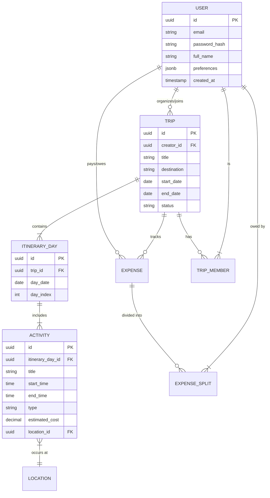

# Entity-Relationship (ER) Diagram

The following diagram outlines the primary data entities and their relationships within the PostgreSQL database.

```mermaid
erDiagram
    USER ||--o{ TRIP : "organizes/joins"
    USER ||--o{ EXPENSE : "pays/owes"
    
    TRIP ||--|{ ITINERARY_DAY : "contains"
    TRIP ||--o{ TRIP_MEMBER : "has"
    TRIP_MEMBER }|--|| USER : "is"
    
    ITINERARY_DAY ||--|{ ACTIVITY : "includes"
    
    ACTIVITY }|--|| LOCATION : "occurs at"
    
    TRIP ||--o{ EXPENSE : "tracks"
    EXPENSE ||--o{ EXPENSE_SPLIT : "divided into"
    EXPENSE_SPLIT }|--|| USER : "owed by"

    USER {
        uuid id PK
        string email
        string password_hash
        string full_name
        jsonb preferences
        timestamp created_at
    }

    TRIP {
        uuid id PK
        uuid creator_id FK
        string title
        string destination
        date start_date
        date end_date
        string status
    }

    ITINERARY_DAY {
        uuid id PK
        uuid trip_id FK
        date day_date
        int day_index
    }

    ACTIVITY {
        uuid id PK
        uuid itinerary_day_id FK
        string title
        time start_time
        time end_time
        string type
        decimal estimated_cost
        uuid location_id FK
    }
```
