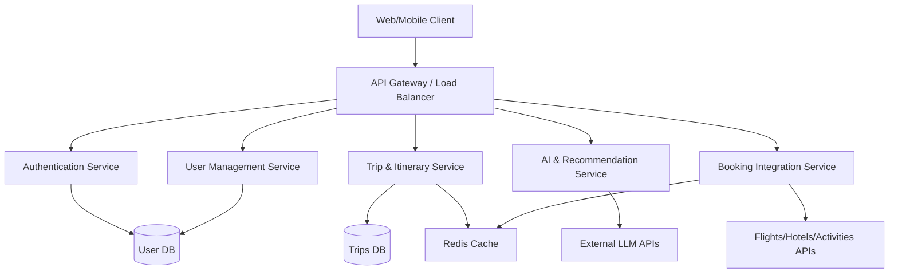

# High-Level Design (HLD)

## 1. System Architecture overview
The AI Travel Planner will follow a modern, microservices-oriented architecture (or a modular monolith for MVP) to ensure scalability, resilience, and independent deployment of key features.

## 2. Core Components
- **Client Application**: React/Next.js for the web interface, communicating via REST/GraphQL APIs.
- **API Gateway**: Handles routing, rate limiting, and SSL termination.
- **Authentication Service**: Manages JWTs, OAuth, and sessions.
- **Trip Service**: The core engine storing itineraries, destinations, and schedules.
- **AI Service**: Acts as an abstraction layer over external LLMs (e.g., OpenAI/Gemini) to generate itineraries and chat responses.
- **Booking Service**: Manages integrations with Amadeus, Skyscanner, or Booking.com APIs.

## 3. Technology Stack Recommendation
- **Frontend**: Next.js, React, TailwindCSS
- **Backend**: Node.js (Express/NestJS) or Python (FastAPI for AI workloads)
- **Database**: PostgreSQL (Relational data) + MongoDB (NoSQL for flexible itinerary structures)
- **Caching**: Redis
- **Infrastructure**: Docker, Kubernetes, AWS/GCP
