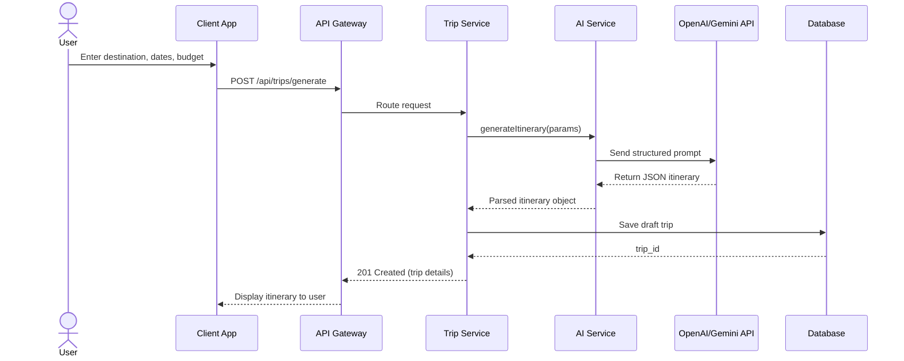
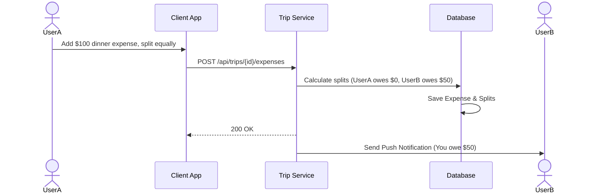

# Sequence Diagrams

## 1. AI Trip Generation Sequence

```mermaid
sequenceDiagram
    actor User
    participant WebClient as Client App
    participant Gateway as API Gateway
    participant TripSvc as Trip Service
    participant AISvc as AI Service
    participant LLM as OpenAI/Gemini API
    participant DB as Database

    User->>WebClient: Enter destination, dates, budget
    WebClient->>Gateway: POST /api/trips/generate
    Gateway->>TripSvc: Route request
    TripSvc->>AISvc: generateItinerary(params)
    AISvc->>LLM: Send structured prompt
    LLM-->>AISvc: Return JSON itinerary
    AISvc-->>TripSvc: Parsed itinerary object
    TripSvc->>DB: Save draft trip
    DB-->>TripSvc: trip_id
    TripSvc-->>Gateway: 201 Created (trip details)
    Gateway-->>WebClient: Display itinerary to user
```

## 2. Group Expense Splitting Sequence

```mermaid
sequenceDiagram
    actor UserA
    participant WebClient as Client App
    participant TripSvc as Trip Service
    participant DB as Database
    actor UserB

    UserA->>WebClient: Add $100 dinner expense, split equally
    WebClient->>TripSvc: POST /api/trips/{id}/expenses
    TripSvc->>DB: Calculate splits (UserA owes $0, UserB owes $50)
    DB->>DB: Save Expense & Splits
    TripSvc-->>WebClient: 200 OK
    TripSvc->>UserB: Send Push Notification (You owe $50)
```
